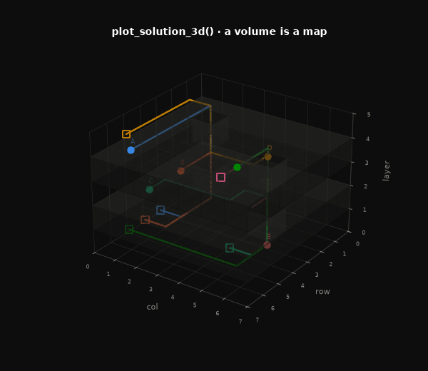
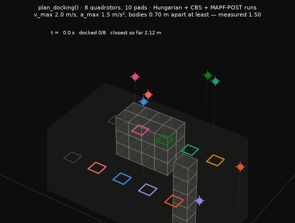
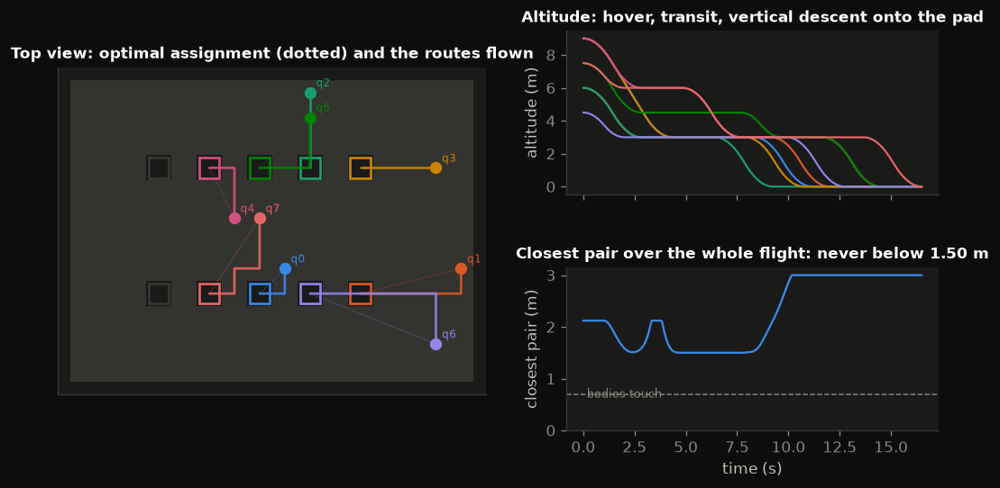
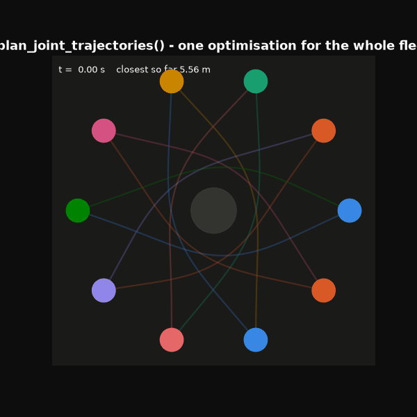
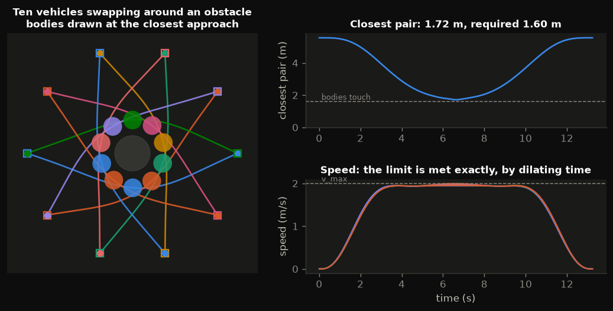
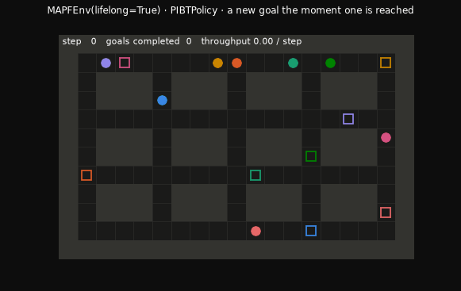
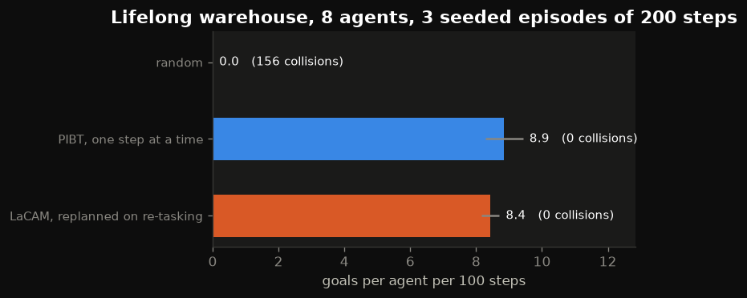
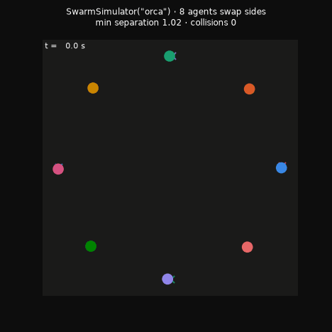
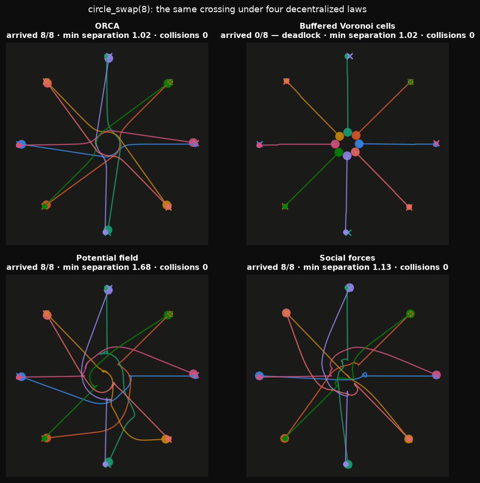

<div align="center">
    
<picture>
  <source media="(prefers-color-scheme: dark)" srcset="https://raw.githubusercontent.com/openplan-labs/branding/main/assets/logo/mark-dark.svg">
  
</picture>
    
</div>

<div align="center">

# PyMAPF

A Python toolbox for Multi-Agents Planning (Centralized and Decentralized)

</div>

<div align="center">
    
[](https://github.com/openplan-labs/pymapf/actions/workflows/tests.yml)
[](https://codecov.io/gh/openplan-labs/pymapf)
[](https://www.codefactor.io/repository/github/openplan-labs/pymapf)
[](http://isitmaintained.com/project/openplan-labs/pymapf "Percentage of issues still open")

[](https://pypi.python.org/pypi/pymapf/)
[](https://github.com/openplan-labs/pymapf/blob/main/LICENSE)
[](https://GitHub.com/openplan-labs/pymapf/graphs/contributors/)

</div>

<div align="center">
    
[Report Bug](https://github.com/openplan-labs/pymapf/issues) · [Request Feature](https://github.com/openplan-labs/pymapf/issues)

Loved the project? Please consider [donating](https://www.buymeacoffee.com/dq01aOE) to help it improve!

</div>

## Features

- 🎮 **[Interactive playground](https://openplan-labs.github.io/pymapf/)** — run the solvers in your browser, watch the search resolve conflicts live
- 🧭 Centralized planners: **CBS**, **Weighted CBS**, Prioritized Planning, **PIBT**, **LaCAM**, **MAPF-LNS** — every one referenced in [REFERENCES.md](REFERENCES.md)
- 🕸️ Works on **arbitrary graphs**, not just grids (roadmaps, warehouse topologies, PRMs)
- 🐦 **Decentralized swarm control**, all object-oriented and registry-based: 10 flocking models (boids, Vicsek, Cucker–Smale, Olfati-Saber, proximal, active-elastic, acceleration-based, Gaussian-kernel, minimalistic, distributed-3D), 5 coverage controllers over 6 pluggable domains, and Gaussian-mixture distribution control
- 🧭 **Decentralized navigation** with a goal per agent: ORCA, buffered Voronoi cells, potential fields and social forces, in any dimension, with the deadlocks they are known for recorded in tests rather than hidden
- 📐 **Formation control** on the displacement / distance / bearing taxonomy, with exact Hungarian slot assignment and a rigidity test that tells you when a target shape is holdable at all
- 🧠 **Multi-agent RL** (`pymapf.rl`): the MAPF instances as a PettingZoo-parallel environment, IPPO and MAPPO that train with **no dependency beyond numpy**, and a benchmark scored against the *optimal* CBS solution rather than another heuristic — plus a **lifelong** mode where agents are re-tasked on arrival and the score is throughput, with PIBT and replanning planners as baselines run through the same loop
- 🔬 **[Extended survey](.docs/survey.md)** of MAPF 2021→2026 plus an experimental section with measured (and negative) results — and a [second edition](.docs/survey-v2.md) that revises the framing around lifelong MAPF, guidance-graph optimisation and learning-inside-search, with the [literature scan](.docs/research-notes.md) behind it
- 🧩 Pluggable solver framework with a name-based registry, pluggable heuristics and deterministic maps
- 🔭 **Observable search**: every solver streams `SearchEvent`s — record them, animate them, or watch them live
- 🗺️ **Nine reproducible scenario families** — six planar (empty room, random obstacles, warehouse, maze, bottleneck, corner swap) and three volumetric (empty volume, random blocks, stacked floors) — plus ASCII maps
- 🧊 **3D**: `VoxelGrid` is a stack of layers with 6- or 26-connectivity, and every solver, heuristic and the trajectory scheduler run on it unchanged
- 📊 **Benchmark harness** with CSV/JSON export and ready-made charts
- 🎬 **Visualisation**: static plots, congestion heatmaps, space-time cubes, timelines, GIF/MP4 animations, live views (window *or* terminal)
- 🚚 **From plans to trajectories**: MAPF-POST-style scheduling turns any discrete plan into time-parameterised, speed- and acceleration-limited trajectories, straight stretches flown as single runs, with a per-hand-over safety margin derived from the actual geometry
- 🚁 **Quadrotor docking**: `pymapf.aerial` assigns a hovering fleet to ground stations (Hungarian, exact), routes it through a voxel airspace (CBS) and flies it down on collision-free kinematic trajectories
- 🛩️ **Joint trajectory optimisation**: `pymapf.trajectory` optimises every vehicle's polynomial trajectory in continuous space in one problem, by sequential convex programming, with a QP solver of its own
- 🔎 Reactive distributed planners (Nonlinear Model Predictive Control, Velocity Obstacles)
- 🪶 Zero runtime dependencies in the core — the solvers are pure standard library

<div align="center">


<em>CBS finding and resolving conflicts, node by node — produced by <code>pymapf.viz.animate_search</code></em>

</div>

## Install

```bash
pip install pymapf                 # the solver framework — no dependencies
pip install "pymapf[viz]"          # + plots, animations and live views
pip install "pymapf[all]"          # + the decentralized/legacy planners
```

From a clone:

```bash
git clone https://github.com/openplan-labs/pymapf && cd pymapf
pip install -e ".[all,dev]"
pytest
```

## Usage

### Quickstart

Cells are `(row, col)`; a truthy grid value marks an obstacle.

```python
import pymapf

grid = pymapf.GridMap([
    [0, 0, 0],
    [0, 1, 0],   # a wall in the middle
    [0, 0, 0],
])
problem = pymapf.MAPFProblem(grid, [
    pymapf.Agent("a", start=(0, 0), goal=(2, 2)),
    pymapf.Agent("b", start=(2, 0), goal=(0, 2)),
])

print(pymapf.available_solvers())
# ['cbs', 'lacam', 'lns', 'pibt', 'prioritized', 'wcbs']

solution = pymapf.solve(problem, "cbs")
print(solution.sum_of_costs, solution.makespan, solution.is_valid())
for name, path in solution.paths.items():
    print(name, path)                      # path[t] is the cell at timestep t
```

### Choosing a solver

| Solver | Name | Guarantee | Use it when |
|---|---|---|---|
| Conflict-Based Search | `"cbs"` | optimal sum-of-costs | you need the best plan and can pay for it |
| Weighted CBS (ECBS) | `"wcbs"` | cost ≤ `w` × optimal | you need most of the quality, much faster |
| **LaCAM** | `"lacam"` | complete | large fleets, milliseconds, quality refined later |
| **PIBT** | `"pibt"` | none (incomplete) | thousands of agents, one timestep at a time |
| Prioritized Planning | `"prioritized"` | none (incomplete) | the classic baseline |
| **MAPF-LNS** | `"lns"` | anytime, never worse than its initial plan | you have a deadline and want the best plan by then |

Measured on `build_scenario("warehouse", n_agents=8, seed=3)`, one run each,
Python 3.10 on an 11th-gen Intel Core i7-11850H. The seed is load-bearing: at
the default `seed=0` the same instance is easy and CBS finishes in 9 ms, and at
`seed=2` CBS exhausts its 10 000-expansion budget and returns nothing.

| Solver | Cost | Wall clock |
| :--- | ---: | ---: |
| CBS | 100 | 4.6 s (6 470 expansions) |
| Weighted CBS | 104 | 18 ms (23 expansions) |
| LaCAM | 136 | 3 ms |
| PIBT | 168 | 3 ms |
| LNS | 100 | 5.0 s — its default `time_limit`, not a time-to-solution |

The full picture, including where each one fails, is in
[`.docs/survey.md`](.docs/survey.md).

CBS is exponential in the number of conflicts, so give it a budget on hard maps:

```python
solution = pymapf.solve(problem, "cbs", time_limit=5.0)      # None if it runs out
bounded  = pymapf.solve(problem, "wcbs", weight=1.5)         # within 50% of optimal
```

### Any graph, not just grids

```python
from pymapf import ExplicitGraph

graph = ExplicitGraph.undirected(
    [("dock", "aisle1"), ("aisle1", "aisle2"), ("aisle2", "pack"), ("dock", "pack")]
)
problem = pymapf.MAPFProblem(graph, [
    pymapf.Agent("r1", "dock", "pack"),
    pymapf.Agent("r2", "pack", "dock"),
])
pymapf.solve(problem, "lacam")      # PIBT and LaCAM use exact graph distances
```

### Scenarios

Reproducible instances, deterministic in their seed:

```python
scenario = pymapf.build_scenario("warehouse", n_agents=8, seed=3)
solution = pymapf.solve(scenario.to_problem(), "wcbs")

print(pymapf.available_scenarios())
# ['bottleneck', 'corner_swap', 'empty_room', 'maze', 'random_obstacles', 'warehouse']
```

Or write the map by hand — lowercase is a start, uppercase the matching goal:

```python
from pymapf.scenarios import from_ascii

scenario = from_ascii("""
##########
#a......A#
#.######.#
#B......b#
##########
""")
```

### Three dimensions 🧊

A `VoxelGrid` is a stack of layers; a cell is `(layer, row, col)`. The solvers
never look at a map's shape — they ask *is this vertex free?* and *what is
adjacent to it?* — so every one of them, the heuristics, the benchmark harness
and the trajectory scheduler run on a volume unchanged.

```python
scenario = pymapf.build_scenario("stacked_floors", floors=3, shafts=2, n_agents=6)
solution = pymapf.solve(scenario.to_problem(), "cbs")

viz.plot_solution_3d(solution, scenario)         # routes threading the floors
print(pymapf.scenarios.to_ascii(scenario))       # one block per layer
```



Connectivity is 6-connected by default and 26-connected with
`allow_diagonals=True`, under the planar corner-cutting rule generalised: a
move that changes several coordinates at once is allowed only if every
axis-aligned part of it is free, so nothing squeezes between two obstacles
that touch at an edge or a corner in any orientation.

Three volumetric families: `empty_volume`, `random_blocks`, and
`stacked_floors` — solid floors joined by a few vertical shafts, the 3D
`bottleneck`, where agents on different floors never interact until they all
need the same column. The third axis is a way *around*: two agents swapping
along a one-wide corridor deadlock on a plane and pass with a layer above.
Measured with CBS on eight agents in a 6×6 footprint, the plane costs a median
of 794 expansions and the same footprint with three layers costs 3.

The learning layer stays planar for now — `MAPFEnv` says so rather than
failing three calls in — and the planar plotters refuse a volume and point at
`plot_solution_3d`.

### From plans to trajectories 🚚

A solver's plan is one cell per timestep. A robot has a top speed, an
acceleration limit and a body, so `pymapf.kinodynamic` turns the plan into
time-parameterised trajectories that respect all three — MAPF-POST (Hönig et
al. 2016): keep the *order* in which agents visit each vertex, discard the
unit-step timing, and re-derive it as the longest path through a simple
temporal network whose constraints are physical.

```python
from pymapf.kinodynamic import KinematicLimits, plan_trajectories

solution = pymapf.solve(scenario.to_problem(), "cbs")
limits = KinematicLimits(v_max=1.5, a_max=3.0, safety_distance=0.5)
trajectories = plan_trajectories(solution, limits=limits, merge_straight=True)

trajectories.makespan                    # seconds, not timesteps
trajectories["A"].position_at(3.25)      # mid-move, as floats
trajectories["A"].velocity_at(3.25)
trajectories.min_separation()            # (distance, time, pair): the closest any two came
```

Every move is a rest-to-rest trapezoidal profile (a triangle when the move is
too short to reach cruise speed), so `v_max` and `a_max` hold at every
instant. With `merge_straight=True` a straight stretch of cells is one run
flown under one profile — the vertices along it are passed *at speed*, not
landed on — which is a quarter faster under an acceleration limit and what a
vehicle that can hover or coast actually does. The safety margin between two
agents at a shared vertex is not one number: the scheduler simulates the two
vehicles' actual motion through it, at their actual speeds and the actual
angle between them, and finds the smallest delay at which they never come
within `safety_distance`. Heterogeneous fleets pass `limits_by_agent`;
general graphs take coordinates from `ExplicitGraph.positions`; a margin too
long for a cycle of agents raises `InfeasibleScheduleError` rather than a
schedule that never finishes.

#### Quadrotor docking: assign, route, fly, land

`pymapf.aerial` is the whole pipeline for an aerial fleet: quadrotors
hovering somewhere, docking stations on the ground, everyone down without
touching. Three exact optimisations, stacked — the Hungarian algorithm
assigns pads by flight distance, CBS routes the fleet through the
discretised airspace, and the scheduler above times the routes under the
vehicles' limits.

```python
from pymapf.aerial import Airspace, hovering_fleet, plan_docking
from pymapf.kinodynamic import KinematicLimits

airspace = Airspace.build(
    cells=(16, 12, 7), cell_size=1.5,                    # 24 x 18 x 10 m of air
    pads=[(3, c) for c in (3, 5, 7, 9, 11)] + [(8, c) for c in (3, 5, 7, 9, 11)],
    obstacles=[((5, 6, 0), (6, 9, 3)), ((1, 13, 0), (1, 13, 5))],   # a building, a mast
    floor=2,                                             # transit at 3 m or above
)
fleet = hovering_fleet(airspace, n=8, seed=4, radius=0.35)
plan = plan_docking(fleet, airspace, limits=KinematicLimits(v_max=2.0, a_max=1.5), clearance=0.3)

plan.assignment                              # {"q0": "pad-7", ...}, optimal
plan.makespan                                # seconds until the last one is down
plan.trajectories["q0"].position_at(4.0)     # metres, mid-flight
plan.min_separation()                        # measured over the whole flight
plan.is_safe()                               # ... and never below two bodies
```



The ground is blocked everywhere but the pads, and with a `floor` the layers
below it are open only in the vertical corridor above each pad — so every
trajectory transits at altitude and ends in a straight descent onto its own
station, and no vehicle ever crosses a pad at ground level. The demo above:
eight vehicles, ten pads, required separation 0.70 m between bodies, measured
1.50 m at the closest; `v_max` and `a_max` hold to within the sampling
resolution.



### Joint trajectory optimisation 🛩️

Everything above plans a **path**: cells on a graph, timed afterwards. This
plans the **trajectory** itself, in continuous space, for the whole fleet at
once. No grid: positions are floats in R², R³ or R^n, and velocity,
acceleration and jerk are exact derivatives of a polynomial rather than
differences of a sampled path.

```python
from pymapf.trajectory import Vehicle, plan_joint_trajectories

fleet = [Vehicle("a", (0.0, 0.0), (10.0, 10.0), radius=0.35),
         Vehicle("b", (10.0, 0.0), (0.0, 10.0), radius=0.35)]

plan = plan_joint_trajectories(fleet, v_max=2.0, a_max=4.0,
                               obstacles=[((5.0, 5.0), 1.5)])

plan.trajectories["a"](3.2)        # position in metres, mid-flight
plan.trajectories["a"](3.2, 1)     # velocity; 2 is acceleration
plan.min_separation()              # (distance, time, pair) over the whole flight
plan.is_safe(), plan.max_speed()
```

One problem, not one per vehicle:

$$\min_{p} \; \sum_i \int_0^T \lVert p_i^{(4)}(t) \rVert^2 dt
\quad\text{s.t.}\quad
\lVert p_i(t) - p_j(t)\rVert \ge r_i + r_j, \;\;
\lVert \dot p_i(t)\rVert \le v_{\max}, \;\;
\lVert \ddot p_i(t)\rVert \le a_{\max}$$

The objective is snap — the derivative a quadrotor's inputs are flat in
(Mellinger and Kumar 2011) — with the endpoints, the rest conditions and
C⁴ continuity as equalities. Separation is the hard part: "stay apart" is the
complement of a ball, so the feasible set is not convex. The optimiser is
**sequential convex programming** (Augugliaro, Schoellig and D'Andrea 2012):
replace each separation constraint by the half-space supporting it at the
current iterate, solve the convex program, re-linearise, repeat inside a
trust region. The half-space lies *inside* the feasible set, so a solution to
the subproblem is genuinely collision-free — the approximation is
conservative, not optimistic.



Three things worth knowing, each measured:

- **Sampling is where the bodies touch.** Constraints are written at finitely
  many times, and a pair that clears the bar at two consecutive samples can
  dip below it in between. On a two-vehicle head-on test that dip is real:
  0.800 m at every sample and **0.742 m** between two of them, for a 0.800 m
  requirement. So the requirement at each sample is raised by a bound on the
  dip, derived from the pair's own relative speed. It costs 26% more snap and
  it is the difference between a plan that is safe and a plan that is safe
  where you looked. Pass `inter_sample=False` for the cheaper, weaker version.
- **The speed limit is met by dilating time.** A norm bound is convex, so its
  linearisation is an *outer* approximation and the optimiser can finish a
  hair over. Rather than fudge it, the fleet's clock is scaled by the smallest
  factor that brings every vehicle inside its envelope. Dilation scales every
  vehicle equally, so the geometry — and every pairwise separation — is
  preserved exactly. That is a test.
- **A discrete plan makes a good seed.** `waypoints_from_solution(solution)`
  turns any CBS or LaCAM plan into the waypoints this optimiser starts from,
  which is how the fleet inherits a *globally* sensible homotopy — which side
  of the obstacle, who goes first — that no local optimiser can find on its own.

Validated against `scipy.optimize.minimize(method="SLSQP")` on the same
problem: the same optimum to **3.8 × 10⁻¹¹** relative, and the same closest
approach. The subproblems are solved by `pymapf.trajectory.solve_qp`, an
augmented-Lagrangian QP in numpy alone, also checked against SLSQP. The
equality constraints are eliminated once into a null-space basis, which is
what makes each iteration a 144-dimensional solve rather than an
816-dimensional one on a six-vehicle instance.



### Watching the search

Solvers push `SearchEvent`s to any callable you pass as `observer`:

```python
trace = pymapf.SearchTrace()
solution = pymapf.solve(scenario.to_problem(), "cbs", observer=trace)

print(trace.summary())
# {'events': 5, 'expansions': 1, 'conflicts': 0, 'branches': 0,
#  'solved': True, 'cost': 14, 'duration': 0.00012}
```

Live, while it runs — in a window, or in the terminal over SSH:

```python
from pymapf.viz import LiveSolveView, LiveConsoleView

with LiveConsoleView(scenario) as view:                    # no display needed
    pymapf.solve(scenario.to_problem(), "cbs", observer=view)
```

### Visualisation

```python
from pymapf import viz

viz.save(viz.plot_solution(solution, scenario), "plan.png")
viz.save(viz.plot_congestion(solution, scenario), "congestion.png")   # traffic hot spots
viz.save(viz.plot_spacetime(solution, scenario), "spacetime.png")     # the 3D search cube
viz.save(viz.plot_timeline(solution), "timeline.png")                 # who waits, when

viz.save_animation(viz.animate_solution(solution, scenario), "plan.gif", fps=16)
viz.save_animation(viz.animate_search(trace, scenario), "search.mp4")
```

| | | |
|---|---|---|
|  |  |  |
| `plot_solution` | `plot_congestion` | `plot_spacetime` |

### Benchmarking

```python
from pymapf.benchmark import compare_algorithms, scaling_study
from pymapf import viz

report = compare_algorithms(["warehouse", "maze"], ["cbs", "wcbs", "prioritized"], time_limit=2.0)
print(report.table())
report.to_csv("results.csv")

scaling = scaling_study("random_obstacles", agent_counts=(2, 4, 6, 8, 10, 12))
viz.dashboard(scaling, report).savefig("dashboard.png")
```


### Adding your own solver

```python
from pymapf.core import MAPFSolver, Solution, register_solver
from pymapf.algorithms import space_time_astar


@register_solver("selfish")
class Selfish(MAPFSolver):
    """Every agent takes its own shortest path and ignores the others."""

    def solve(self, problem, observer=None):
        paths = {
            agent.name: space_time_astar(problem.grid, agent.start, agent.goal)
            for agent in problem.agents
        }
        return Solution(paths=paths, algorithm=self.name)


pymapf.solve(problem, "selfish").first_conflict()   # spoiler: there is one
```

### Swarms: flocking, coverage and distribution

Same conventions as the planners — an abstract base class per family, a name
registry, swappable strategy objects.

```python
from pymapf.swarm import SwarmSimulator, available_behaviors

# Seventeen names: 10 flocking, 5 formation, 2 distribution. The two
# distribution behaviours need a target to match, so they are constructed
# directly rather than through this loop.
for name in available_behaviors():
    if name in ("density_matching", "mixture_assignment"):
        continue
    result = SwarmSimulator(name, n_agents=20).run(steps=300)
    print(name, result.metrics.summary())
```

**Who each agent sees** is a strategy object, and it changes the collective
behaviour as much as the control law does:

```python
from pymapf.swarm import SwarmSimulator, TopologicalNeighborhood

SwarmSimulator("acceleration", neighborhood=TopologicalNeighborhood(k=5))
# better spacing (2.17 m vs 1.60 m) with a third of the connectivity
```

**Composition** rather than new classes:

```python
from pymapf.swarm import CompositeBehavior, CuckerSmale, AccelerationFlocking

blend = CompositeBehavior([(CuckerSmale(), 0.5), (AccelerationFlocking(), 1.0)])
```

**Coverage** is written against a domain, so one controller serves every shape:

```python
from pymapf.swarm import CoverageSimulator

for domain in ("planar", "disk", "sphere", "hemisphere", "annulus"):
    print(domain, CoverageSimulator("lloyd", domain=domain, n_agents=9).run(steps=40).improvement)
```

Controllers: `lloyd`, `limited_range`, `adaptive` (learns the density online),
`gmm` (splits the team across mixture components), `time_varying` (pursues
moving targets).

**Gaussian mixtures** are the importance model *and* the target distribution:

```python
from pymapf.swarm import GaussianMixtureDensity, SwarmSimulator

target = GaussianMixtureDensity(means=[(-8, 0), (8, 4), (0, -9)],
                                covariances=[3., 3., 2.], weights=[.4, .4, .2])
sim = SwarmSimulator("mixture_assignment", n_agents=30, mixture=target)
sim.run(steps=400)          # allocation lands on 12 / 12 / 6 — exactly the quota

fitted = GaussianMixtureDensity.fit(observations, k=2)   # EM from measurements
```

**Formation control** is organised by *what each agent can measure* — the
displacement / distance / bearing taxonomy — because that is what decides which
symmetry you can fix:

```python
from pymapf.swarm import SwarmSimulator, is_infinitesimally_rigid, get_shape

for law in ["displacement_formation", "distance_formation",
            "bearing_formation", "leader_follower"]:
    sim = SwarmSimulator(law, n_agents=9, shape="v", spacing=3.0)
    result = sim.run(steps=800)
    print(law, sim.behavior.error(result.final))     # graded under the
                                                     # symmetries it can't see
```

| Law | Agent measures | Formation fixed up to | Converges in |
|---|---|---|---|
| `displacement_formation` | relative position, shared frame | translation | 3.6 s |
| `distance_formation` | range only | translation, rotation, reflection | 15.6 s |
| `bearing_formation` | direction only (cameras) | translation, **scale** | 41.1 s |
| `leader_follower` | offset from a leader | translation | 4.7 s |

The less each agent senses, the longer it takes — that is the taxonomy restated
as a cost. Distance and bearing control also need the constraint graph to be
**rigid**, and the library says so before you fly it:

```python
line = get_shape("line", spacing=3.0).centred(6, 2)
is_infinitesimally_rigid(line, [(i, j) for i in range(6) for j in range(i + 1, 6)])
# False — a collinear target has flex modes no first-order controller can see
```

The functional API in `pymapf.decentralized.flocking` / `.coverage` still works;
it now delegates to this layer.

### Reinforcement learning

The same instances the planners solve, as a multi-agent environment — and the
reason to have it here rather than in a separate repo is that a rollout comes
back as a `pymapf.Solution`, so a learned policy and CBS are scored by
*identical* code:

```python
from pymapf.rl import MAPFEnv, make_trainer, compare

env = MAPFEnv("random_obstacles", n_agents=4, height=10, width=10)
trainer = make_trainer("mappo", env)      # or "ippo"
trainer.learn(total_steps=400_000)        # ~7k steps/s, numpy only

for row in compare(env, {"mappo": trainer}, episodes=100):
    print(row["method"], row["success_rate"], row["suboptimality"])
```

It follows the **PettingZoo Parallel API** without importing PettingZoo, so it
runs in a bare environment and still drops into any MARL library
(`env.to_pettingzoo()` when you want the real base class). Observations,
rewards and algorithms are registries like everything else:

```python
from pymapf.rl import register_observation, LocalWindow

@register_observation("my_encoding")
class MyEncoder(LocalWindow):
    ...
```

Three things it gets from living inside the library:

- **exact reward shaping.** `ShapedReward` uses the backward-Dijkstra distance
  oracle the solvers already use, so the potential is the true remaining cost
  rather than a Manhattan guess — and being potential-based, it is
  policy-invariant (Ng et al. 1999).
- **conflict-freedom by construction.** Vertex, edge and cascading conflicts are
  resolved with MAPF's rules, so *any* rollout is a valid plan. Validity is
  100% in the table below because it cannot be otherwise.
- **true suboptimality.** CBS is optimal, so the ratio is measured against
  ground truth, not against another heuristic.

Measured on `empty_room`, 2 agents, 400k steps of IPPO — and this is the result
worth knowing about:

| method | solved | cost | vs optimal |
|---|---|---|---|
| IPPO, greedy (argmax) | 45% | 10.5 | **1.11x** |
| IPPO, sampled | **100%** | 27.3 | 2.94x |
| CBS (optimal) | 100% | 9.6 | 1.00x |

<sub>Read from [`.docs/assets/rl-benchmark.json`](.docs/assets/rl-benchmark.json),
which `scripts/train_rl.py` writes. The [playground](https://openplan-labs.github.io/pymapf/#learning)
renders all four settings from that same file.</sub>

The same weights, evaluated two ways — and the gap has **two** causes, measured
over 80 instances (33 greedy failures, no wall contacts, and in every case both
agents solve that instance fine *alone*):

- **70%** are collision-free **period-2 orbits**. The agents never touch. The
  argmax makes each a deterministic function of an observation that contains the
  other agent, and the pair settles onto a closed loop.
- **30%** are **period-1 freezes** with a collision on every step — a genuine
  livelock, two agents each wanting the cell the other holds. The same failure
  PIBT has, reached by a different route.

Both have the same cure: sampling is the only noise in the system, so it always
escapes — and it also wanders, hence 3x the cost. Reporting either number alone
would be reporting half the result, so `compare()` reports both by default.

There is a short film for this layer — `.docs/assets/pymapf-rl-promo.mp4`, built
by `scripts/make_rl_promo.py`. It trains the policy while it renders, so the
split-screen is that policy acting on one shared instance, and the 70/30 split
is measured over 80 instances during the render rather than quoted.

#### Lifelong MAPF: throughput, not cost

One-shot MAPF is a benchmark. The deployed problem is *lifelong*: an agent
that reaches its goal is immediately given another, nothing ever terminates,
and the number that matters is **throughput**. Sum-of-costs is not an
approximation of that objective — it is undefined when nothing ends — which
is why the second edition of the survey put a lifelong mode at the top of its
open problems. It is one flag now:

```python
from pymapf.rl import MAPFEnv, PIBTPolicy, compare_lifelong

env = MAPFEnv("warehouse", n_agents=8, lifelong=True)     # re-tasked on arrival
observations, _ = env.reset(seed=0)
# ... step it like any other; the episode runs to max_steps, and
env.episode_summary()["throughput"]                        # goals completed per step

rows = compare_lifelong(env, {"ippo": trainer}, episodes=20, baselines=("pibt", "lacam"))
```



New goals are drawn from the environment's own RNG, so two policies scored on
the same seed face the *same sequence of tasks*, not just the same map. The
shaped reward's potential follows the current goal — it is cached per goal
cell rather than per agent, so a re-tasking never rewards walking back.

The baselines are planners wrapped as policies (`pymapf.rl.baselines`), so
they run through the very same loop as the network and are scored on the very
same episodes: `PIBTPolicy` re-decides every step with the priority rule from
the PIBT paper's lifelong experiments, the standard lifelong baseline;
`ReplanPolicy` runs a full solver from the current configuration whenever a
goal changes. `compare_lifelong` reports throughput per agent per hundred
steps so instances of different size read alike.

Measured on the 8-agent warehouse over five seeded episodes of 496 steps:

| method | goals / agent / 100 steps | collisions | time per episode |
|---|---|---|---|
| random | 0.1 | 123 | 0.29 s |
| PIBT, one step at a time | **8.5** | 0 | 0.40 s |
| LaCAM, replanned on every re-tasking | 8.4 | 0 | 2.34 s |

The one-step rule matches the replanning solver's throughput at a sixth of
the cost — which is the argument the lifelong literature makes for it, and
now a number this repository produces.



### Decentralized navigation 🧭

The flocking and formation behaviors share one waypoint. These give every
agent a destination of its own and ask it to get there from local information
only — the problem a fleet faces once the central planner is gone.

```python
from pymapf.swarm import SwarmSimulator, SwarmParams, circle_swap

state, goals = circle_swap(n=8, radius=10.0)          # everyone crosses the centre
params = SwarmParams(separation_distance=1.0, cruise_speed=1.5)
result = SwarmSimulator("orca", initial=state, params=params, goals=goals).run(steps=600)

result.metrics.collisions              # 0
min(result.metrics.min_distance)       # >= 1.0, the separation asked for
```



Four laws, two ideas of what "safe" means:

| Law | Name | Kind | What it guarantees |
|---|---|---|---|
| ORCA (van den Berg et al. 2011) | `"orca"` | constraint | no collision while the velocity set is non-empty |
| Buffered Voronoi cells (Zhou et al. 2017) | `"buffered_voronoi"` | constraint | no collision, with no velocity information at all |
| Potential fields (Khatib 1986) | `"potential_field"` | force | nothing |
| Social forces (Helbing & Molnár 1995) | `"social_force"` | force | nothing |

All four are written for any dimension — ORCA's velocity obstacle is
rotationally symmetric about the line between two agents, so its geometry
lives in a plane whatever the ambient space — and the velocity is chosen by
an exact projection onto the constraint set (RVO2's incremental linear
programs, generalised to *n* dimensions by recursion) rather than an
iterative one. That distinction found a bug: an iterative projection that
stalled short of the cell let agents brush to 0.67 of a 1.0 separation; the
exact one holds 1.02 in every run.

What was measured, on the circle swap with separation 1.0:

- **ORCA** never collides, and arrives with 4, 8 and 24 agents in 2D and 16
  on a sphere. Twelve agents form a ring it does not break, with or without
  tie-breaking noise — the symmetric deadlock the literature describes.
- **Buffered Voronoi** never collides, in 2D or 3D, and deadlocks on any
  symmetric crossing, as its paper says. It passes an offset pair and
  staggered lanes.
- **Potential fields** and **social forces** solve the 8- and 12-agent swaps
  outright, and the potential field parks in the local minimum behind an
  obstacle exactly where Khatib said it would.

Each of those is a test, including the failures — and one figure, from
`scripts/generate_feature_demos.py`:



### Reactive planners

```python
from pymapf.decentralized.nmpc.nmpc import MultiAgentNMPC
from pymapf.decentralized.position import Position
import numpy as np

sim = MultiAgentNMPC()
sim.register_agent("r2d2", Position(0, 3), Position(10, 7))
sim.register_agent("bb8", Position(0, 7), Position(5, 10))
sim.register_agent("c3po", Position(10, 7), Position(5, 0))
sim.register_obstacle(2, np.pi / 4, Position(0, 0))
sim.run_simulation()
sim.visualize("filename_test", 10, 10)
```

```python
from pymapf.decentralized.velocity_obstacle.velocity_obstacle import MultiAgentVelocityObstacle
from pymapf.decentralized.position import Position

sim = MultiAgentVelocityObstacle(simulation_time=8.0)
sim.register_agent("r2d2", Position(0, 3), Position(10, 7))
sim.register_agent("bb8", Position(0, 7), Position(5, 10))
sim.register_agent("c3po", Position(10, 7), Position(5, 0))
sim.run_simulation()
sim.visualize("filename_test_2", 10, 10)
```

### Scripts

```bash
python scripts/generate_gallery.py     # every figure in .docs/assets
python scripts/generate_feature_demos.py  # the quadrotor, trajectory, 3D, navigation and lifelong demos
python scripts/make_promo.py           # the promo film
python scripts/make_rl_promo.py        # the learning-layer film
python scripts/train_rl.py             # train IPPO/MAPPO, benchmark vs CBS
python scripts/build_web_bundle.py     # refresh the playground's copy of the library
python scripts/switch_positions_nmpc.py
```

### The playground

`.docs/` is a static site that runs PyMAPF in the browser under Pyodide — the
same source files, loaded into a WebAssembly interpreter, with a JavaScript port
of the solvers as an instant-response fallback. Serve it locally with:

```bash
python -m http.server -d .docs 8000
```

## Cite

If you use the project in your work, please consider citing it with:
```
@misc{https://doi.org/10.13140/rg.2.2.14030.28486,
  doi = {10.13140/RG.2.2.14030.28486},
  url = {http://rgdoi.net/10.13140/RG.2.2.14030.28486},
  author = {Erwin Lejeune and Sampreet Sarkar},
  language = {en},
  title = {Survey of the Multi-Agent Pathfinding Solutions},
  publisher = {Unpublished},
  year = {2021}
}
```

List of publications & preprints using `pymapf` (please open a pull request to add missing entries):

* [Survey of MAPF solutions](https://www.researchgate.net/publication/348716625_Survey_of_the_Multi-Agent_Pathfinding_Solutions) (January 2021)

## Contribute

Open an issue to state clearly the contribution you want to make. Upon aproval send in a PR with the Issue referenced. (Implement Issue #No / Fix Issue #No).

## Maintainers

- Erwin Lejeune
- Sampreet Sarkar
